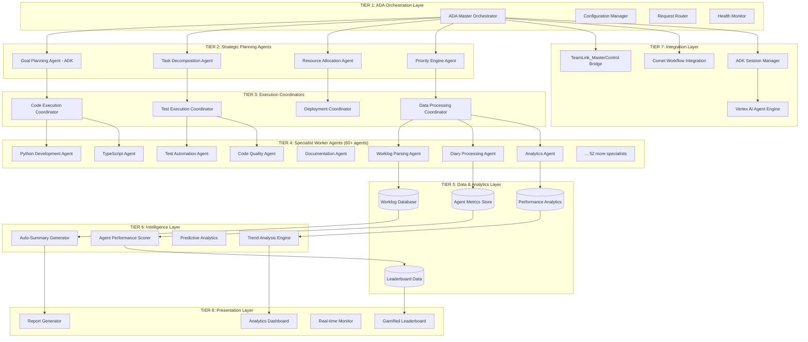
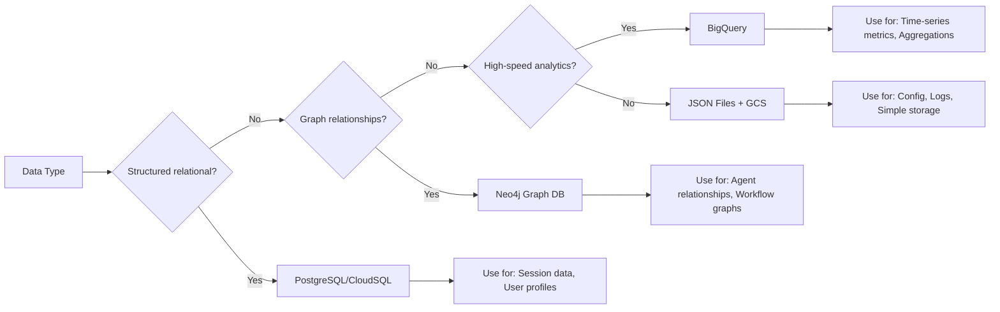
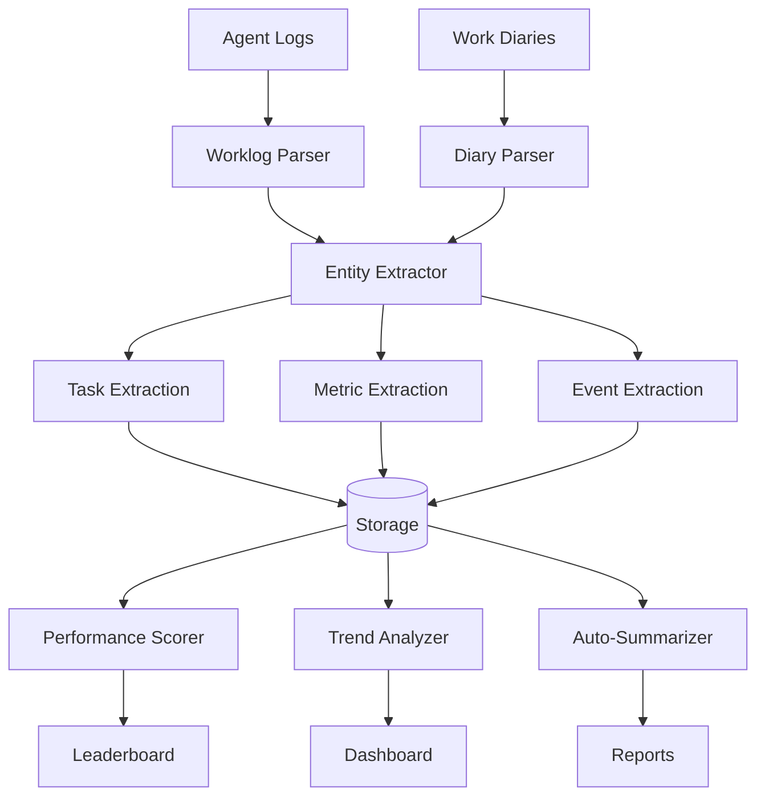

# LearnQwest Multi-Agent Orchestration Architecture
## 8-Tier Agent Hierarchy with ADA Orchestration

**Generated:** 2025-11-16
**System:** ADK Fullstack + ADA/Comet + TeamLink Integration
**Deployment Target:** November 18th Production Ready

---

## Executive Summary

LearnQwest leverages a hierarchical 8-tier agent architecture orchestrated by ADA (Autonomous Development Agent) to manage 60+ specialized agents across learning, development, and analytics workflows.

**Foundation:** Google ADK (Agent Development Kit) with Vertex AI Agent Engine
**Orchestrator:** ADA (master control layer)
**Extensions:** Comet (agentic workflows), TeamLink_MasterControl (cross-system integration)

---

## Architecture Overview



---

## Tier Breakdown

### **TIER 1: ADA Orchestration Layer**
**Purpose:** Master control plane for all agent operations

**Components:**
- **ADA Master Orchestrator** (`app/ada/orchestrator.py`)
  - Routes requests to appropriate tier-2 agents
  - Manages agent lifecycle (spawn, monitor, terminate)
  - Implements health checks and auto-recovery
  - Tracks agent performance metrics

- **Configuration Manager** (`app/ada/config_manager.py`)
  - Environment-aware configuration
  - Agent registration and discovery
  - Dynamic scaling policies

- **Request Router** (`app/ada/router.py`)
  - Intelligent request routing based on:
    - Request type (code, test, analytics, etc.)
    - Agent availability and load
    - Priority and SLA requirements

- **Health Monitor** (`app/ada/health_monitor.py`)
  - Real-time agent health checks
  - Performance bottleneck detection
  - Auto-remediation triggers

---

### **TIER 2: Strategic Planning Agents**
**Purpose:** High-level goal decomposition and resource planning

**Components:**
1. **Goal Planning Agent** (existing ADK agent from `app/agent.py`)
   - Uses Gemini 2.5 Flash with BuiltInPlanner
   - Decomposes user goals into actionable tasks
   - Outputs structured task breakdown

2. **Task Decomposition Agent** (`app/agents/task_decomposer.py`)
   - Receives task breakdown from Goal Planner
   - Creates detailed execution plans
   - Assigns tasks to tier-3 coordinators

3. **Resource Allocation Agent** (`app/agents/resource_allocator.py`)
   - Manages computational resources
   - Balances load across worker agents
   - Implements priority queuing

4. **Priority Engine Agent** (`app/agents/priority_engine.py`)
   - Evaluates task urgency
   - Implements SLA-based scheduling
   - Dynamic re-prioritization based on context

---

### **TIER 3: Execution Coordinators**
**Purpose:** Domain-specific execution orchestration

**Coordinators:**
- **Code Execution Coordinator** → Routes to Python/TypeScript/etc. agents
- **Test Execution Coordinator** → Routes to test automation agents
- **Deployment Coordinator** → Manages CI/CD pipeline agents
- **Data Processing Coordinator** → Routes to analytics/parsing agents

Each coordinator:
- Manages a pool of specialized worker agents
- Implements retry logic and error handling
- Tracks execution metrics
- Reports back to tier-2 strategic planners

---

### **TIER 4: Specialist Worker Agents (60+ agents)**
**Purpose:** Execute specific tasks with domain expertise

**Categories:**

**Development Agents:**
- Python Development Agent
- TypeScript/JavaScript Agent
- Go Development Agent
- Rust Development Agent
- Shell Script Agent

**Quality Agents:**
- Unit Test Agent
- Integration Test Agent
- E2E Test Agent
- Linting Agent (Ruff, ESLint)
- Type Checking Agent (MyPy, TypeScript)
- Security Scanning Agent

**Documentation Agents:**
- API Documentation Agent
- README Generator Agent
- Changelog Agent
- Mermaid Diagram Agent

**Data & Analytics Agents:**
- Worklog Parsing Agent
- Diary Processing Agent
- Log Analysis Agent
- Metrics Collection Agent
- Performance Profiling Agent

**Infrastructure Agents:**
- Docker Build Agent
- Kubernetes Deploy Agent
- Cloud Deployment Agent (Vertex AI, Cloud Run)
- Database Migration Agent

**Monitoring Agents:**
- Health Check Agent
- Alert Management Agent
- Trace Analysis Agent (OpenTelemetry)
- Error Aggregation Agent

---

### **TIER 5: Data & Analytics Layer**
**Purpose:** Persistent storage for agent operations and metrics

**Backend Decision Tree:**



**Recommended Multi-Backend Strategy:**
1. **PostgreSQL (CloudSQL)** → Session data, user management, structured logs
2. **Neo4j** → Agent dependency graphs, workflow relationships
3. **BigQuery** → Time-series agent metrics, performance analytics
4. **GCS (JSON)** → Configuration, artifacts, overflow storage

**Data Stores:**
- `worklog_database` → Raw worklog entries with timestamps
- `agent_metrics_store` → Agent performance data (response time, success rate, resource usage)
- `performance_analytics` → Aggregated analytics for dashboards
- `leaderboard_data` → Gamified agent scoring and rankings

---

### **TIER 6: Intelligence Layer**
**Purpose:** Analytics, scoring, and predictive insights

**Components:**

1. **Agent Performance Scorer** (`app/intelligence/scorer.py`)
   - Calculates agent efficiency metrics:
     - Task completion rate
     - Average response time
     - Error rate
     - Resource consumption efficiency
   - Generates composite scores (0-100)
   - Identifies top performers and underperformers

2. **Trend Analysis Engine** (`app/intelligence/trend_analyzer.py`)
   - Time-series analysis of agent performance
   - Detects performance degradation patterns
   - Identifies optimization opportunities

3. **Predictive Analytics** (`app/intelligence/predictive.py`)
   - Forecasts resource requirements
   - Predicts task completion times
   - Recommends optimal agent assignments

4. **Auto-Summary Generator** (`app/intelligence/summarizer.py`)
   - Generates natural language summaries of:
     - Daily agent activity
     - Project milestones
     - Performance reports
   - Uses Gemini for intelligent summarization

---

### **TIER 7: Integration Layer**
**Purpose:** External system bridges and ADK session management

**Bridges:**

1. **TeamLink_MasterControl Bridge** (`app/integrations/teamlink_bridge.py`)
   - Connects to TeamLink_MasterControl ecosystem
   - Synchronizes agent states across systems
   - Implements cross-system messaging

2. **Comet Workflow Integration** (`app/integrations/comet_integration.py`)
   - Integrates with Comet agentic workflows
   - Enables hybrid ADA-Comet orchestration
   - Supports workflow chaining

3. **ADK Session Manager** (existing `nextjs/src/lib/services/session-service.ts`)
   - Manages ADK sessions for all agents
   - Handles session persistence and recovery
   - Implements session-based state management

4. **Vertex AI Agent Engine** (existing `app/agent_engine_app.py`)
   - Cloud deployment platform
   - Scalable agent hosting
   - Managed infrastructure

---

### **TIER 8: Presentation Layer**
**Purpose:** User interfaces for monitoring, analytics, and gamification

**Components:**

1. **Analytics Dashboard** (`nextjs/src/app/dashboard/page.tsx`)
   - Real-time agent activity monitor
   - Performance metrics visualization
   - Resource utilization graphs
   - Alert and incident timeline

2. **Gamified Leaderboard** (`nextjs/src/app/leaderboard/page.tsx`)
   - Agent ranking by performance score
   - Achievement badges and milestones
   - Competition modes (daily/weekly/monthly)
   - Agent profile pages with detailed stats

3. **Real-time Monitor** (`nextjs/src/components/monitor/RealtimeMonitor.tsx`)
   - Live agent status updates
   - WebSocket/SSE streaming
   - Interactive agent control (pause/resume/kill)
   - Trace visualization

4. **Report Generator** (`nextjs/src/app/reports/page.tsx`)
   - Automated report generation
   - PDF/CSV export capabilities
   - Customizable report templates
   - Scheduled report delivery

---

## Agent Conversion Pipeline

**Purpose:** Batch convert existing programs/features into autonomous agents

```mermaid
graph LR
    Input[Feature List] --> Analyzer[Feature Analyzer]
    Analyzer --> Template[Agent Template Generator]
    Template --> Scaffold[Code Scaffolder]
    Scaffold --> ADKWrapper[ADK Integration Wrapper]
    ADKWrapper --> Register[ADA Registry]
    Register --> Deploy[Deployment Pipeline]
    Deploy --> Monitor[Health Check]
    Monitor --> Active[Active Agent Pool]
```



**Conversion Process:**
1. **Input:** List of features/programs to convert
2. **Analysis:** Extract inputs, outputs, dependencies
3. **Template Generation:** Create agent manifest with:
   - Agent name and description
   - Required tools and capabilities
   - Input/output schemas
   - Success criteria
4. **Scaffolding:** Generate agent code using ADK `LlmAgent` base class
5. **Integration:** Wrap with ADA orchestration hooks
6. **Registration:** Add to ADA agent registry
7. **Deployment:** Deploy to Vertex AI or local pool
8. **Monitoring:** Add to health check rotation

**Parallel Batch Conversion:**
- Process up to 10 agents simultaneously
- Use async/await patterns for concurrent generation
- Atomic registration to prevent conflicts

---

## Worklog/Diary Parsing System

**Purpose:** Extract insights from agent activity logs and work diaries



**Parsing Logic:**

**Worklog Parser** (`app/parsers/worklog_parser.py`):
- Extracts structured data from unstructured logs
- Identifies:
  - Task start/completion timestamps
  - Agent interactions
  - Resource consumption
  - Errors and warnings
  - Decision points

**Diary Parser** (`app/parsers/diary_parser.py`):
- Processes natural language work diaries
- Uses LLM to extract:
  - Accomplishments
  - Blockers and challenges
  - Collaboration events
  - Learning insights

**Entity Extraction:**
- Task names and IDs
- Agent names and roles
- Timestamps and durations
- Outcome status (success/failure/partial)
- Metadata (files changed, tests run, etc.)

---

## Deployment Architecture

### Local Development
```
ADA Orchestrator (Python) → port 8000
  ↓
ADK API Server → manages agent pool
  ↓
Next.js Frontend → port 3000
  ↓
WebSocket/SSE streaming → real-time updates
```

### Production (Vertex AI + Vercel)
```
User Request
  ↓
Vercel (Next.js) → AGENT_ENGINE_ENDPOINT
  ↓
Vertex AI Agent Engine
  ↓
ADA Orchestrator
  ↓
60+ Specialist Agents (auto-scaled)
  ↓
BigQuery + CloudSQL + Neo4j + GCS
  ↓
Response streaming back to user
```

---

## File Structure Extensions

```
/home/user/adk-fullstack-deploy-tutorial/
├── app/
│   ├── ada/                              # TIER 1: ADA Orchestration
│   │   ├── __init__.py
│   │   ├── orchestrator.py               # Master orchestrator
│   │   ├── config_manager.py             # Configuration
│   │   ├── router.py                     # Request routing
│   │   ├── health_monitor.py             # Health checks
│   │   └── registry.py                   # Agent registry
│   │
│   ├── agents/                           # TIER 2 & 4: Planning + Workers
│   │   ├── strategic/                    # TIER 2
│   │   │   ├── task_decomposer.py
│   │   │   ├── resource_allocator.py
│   │   │   └── priority_engine.py
│   │   │
│   │   ├── coordinators/                 # TIER 3
│   │   │   ├── code_executor.py
│   │   │   ├── test_executor.py
│   │   │   ├── deploy_coordinator.py
│   │   │   └── data_coordinator.py
│   │   │
│   │   └── workers/                      # TIER 4 (60+ agents)
│   │       ├── development/
│   │       │   ├── python_agent.py
│   │       │   ├── typescript_agent.py
│   │       │   └── ...
│   │       ├── quality/
│   │       │   ├── test_agent.py
│   │       │   ├── lint_agent.py
│   │       │   └── ...
│   │       ├── data/
│   │       │   ├── worklog_parser_agent.py
│   │       │   ├── diary_processor_agent.py
│   │       │   └── analytics_agent.py
│   │       └── infrastructure/
│   │           ├── docker_agent.py
│   │           └── deploy_agent.py
│   │
│   ├── parsers/                          # TIER 5: Data parsing
│   │   ├── worklog_parser.py
│   │   ├── diary_parser.py
│   │   └── entity_extractor.py
│   │
│   ├── intelligence/                     # TIER 6: Analytics
│   │   ├── scorer.py
│   │   ├── trend_analyzer.py
│   │   ├── predictive.py
│   │   └── summarizer.py
│   │
│   ├── integrations/                     # TIER 7: Bridges
│   │   ├── teamlink_bridge.py
│   │   ├── comet_integration.py
│   │   └── database/
│   │       ├── postgres_client.py
│   │       ├── neo4j_client.py
│   │       ├── bigquery_client.py
│   │       └── gcs_client.py
│   │
│   ├── conversion/                       # Agent conversion pipeline
│   │   ├── feature_analyzer.py
│   │   ├── template_generator.py
│   │   ├── scaffolder.py
│   │   └── batch_converter.py
│   │
│   └── schemas/                          # Data schemas
│       ├── agent_manifest.py
│       ├── worklog_schema.py
│       ├── metrics_schema.py
│       └── leaderboard_schema.py
│
├── nextjs/src/
│   ├── app/
│   │   ├── dashboard/                    # TIER 8: Analytics UI
│   │   │   └── page.tsx
│   │   ├── leaderboard/                  # TIER 8: Gamification
│   │   │   └── page.tsx
│   │   ├── reports/                      # TIER 8: Reports
│   │   │   └── page.tsx
│   │   └── monitor/                      # TIER 8: Real-time
│   │       └── page.tsx
│   │
│   ├── components/
│   │   ├── dashboard/
│   │   │   ├── AgentActivityChart.tsx
│   │   │   ├── PerformanceMetrics.tsx
│   │   │   └── ResourceMonitor.tsx
│   │   ├── leaderboard/
│   │   │   ├── AgentRankings.tsx
│   │   │   ├── AchievementBadges.tsx
│   │   │   └── AgentProfile.tsx
│   │   └── monitor/
│   │       ├── RealtimeMonitor.tsx
│   │       ├── AgentStatusGrid.tsx
│   │       └── TraceVisualizer.tsx
│   │
│   └── lib/
│       ├── api/
│       │   ├── dashboard-api.ts
│       │   ├── leaderboard-api.ts
│       │   └── agent-api.ts
│       └── types/
│           ├── agent-types.ts
│           ├── metrics-types.ts
│           └── leaderboard-types.ts
│
├── docs/
│   ├── AGENT_MANIFEST_SPEC.md
│   ├── WORKLOG_FORMAT.md
│   ├── SCORING_ALGORITHM.md
│   └── workflows/
│       ├── agent_creation_workflow.md
│       └── deployment_workflow.md
│
└── config/
    ├── agent_registry.json               # Central agent registry
    ├── scoring_weights.json              # Scoring configuration
    └── integration_endpoints.json        # TeamLink/Comet endpoints
```

---

## Implementation Roadmap

### Phase 1: Foundation (Day 1)
- [x] Map existing ADK template
- [ ] Create ADA orchestrator core
- [ ] Implement agent registry
- [ ] Build basic health monitoring

### Phase 2: Data Layer (Day 1)
- [ ] Design database schemas
- [ ] Implement worklog parser
- [ ] Create diary processor
- [ ] Set up data storage (PostgreSQL + GCS)

### Phase 3: Intelligence (Day 2)
- [ ] Build performance scorer
- [ ] Implement trend analyzer
- [ ] Create auto-summarizer
- [ ] Develop predictive models

### Phase 4: Worker Agents (Day 2)
- [ ] Create agent templates
- [ ] Build conversion pipeline
- [ ] Generate 20 core worker agents
- [ ] Implement batch conversion system

### Phase 5: Presentation (Day 2)
- [ ] Build analytics dashboard
- [ ] Create gamified leaderboard
- [ ] Implement real-time monitor
- [ ] Add report generator

### Phase 6: Integration (Day 3 - Nov 18)
- [ ] TeamLink_MasterControl bridge
- [ ] Comet workflow integration
- [ ] End-to-end testing
- [ ] Production deployment

---

## Success Metrics

**System Health:**
- All 60+ agents registering and responding
- <100ms routing latency from ADA
- >99% uptime for tier-1 orchestrator

**Agent Performance:**
- Average task completion time <5 seconds
- Error rate <1% across all agents
- Resource utilization 60-80% optimal

**Analytics:**
- Worklog parsing accuracy >95%
- Real-time dashboard updates <500ms latency
- Leaderboard recalculation <1 second

**Business Impact:**
- 90% reduction in manual task orchestration
- 10x increase in parallel task execution
- Real-time visibility into all agent operations

---

## References

**ADK Documentation:** https://github.com/googleapis/python-genai
**Vertex AI Agent Engine:** https://cloud.google.com/vertex-ai/docs/agents
**Existing Codebase:** `/home/user/adk-fullstack-deploy-tutorial/`

---

**END OF ARCHITECTURE DOCUMENT**
**Status:** Ready for implementation
**Target:** November 18th, 2025
