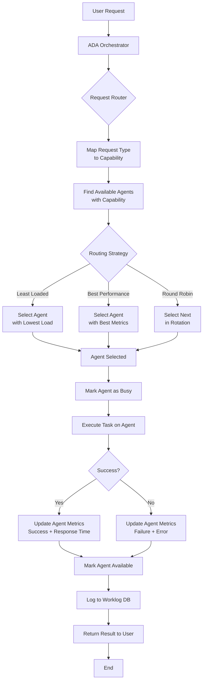
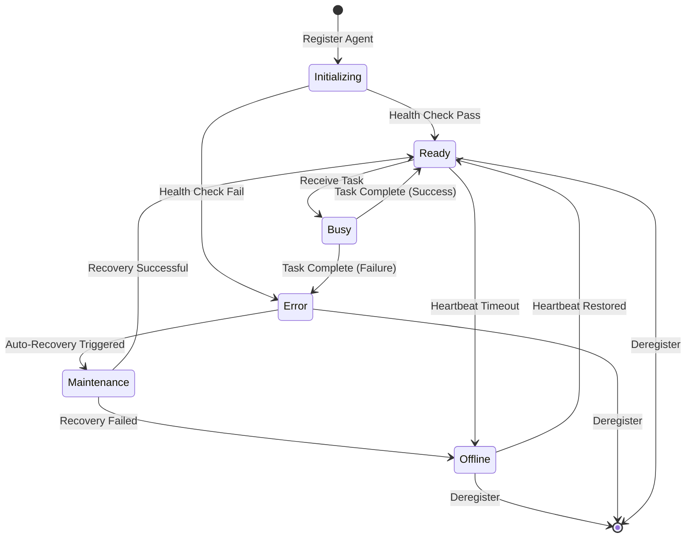
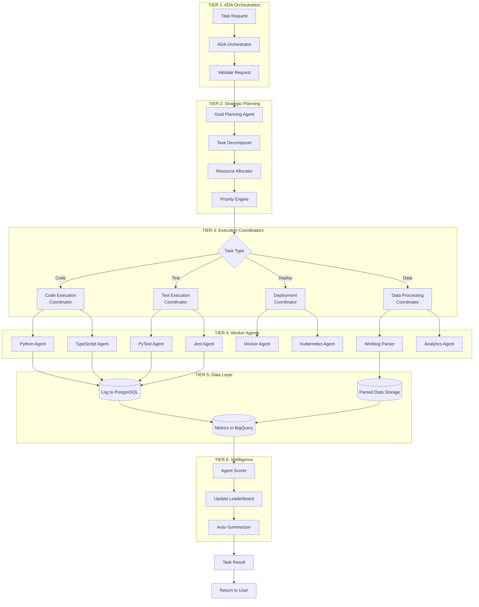
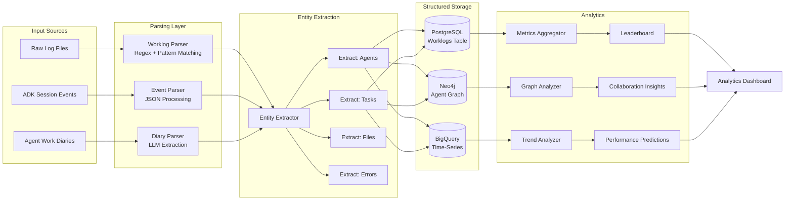
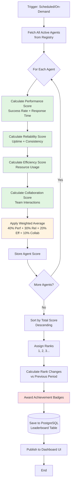
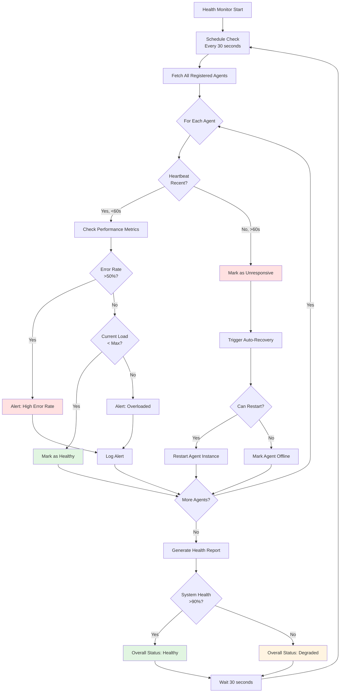
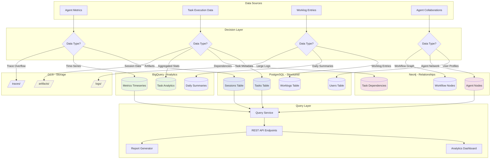
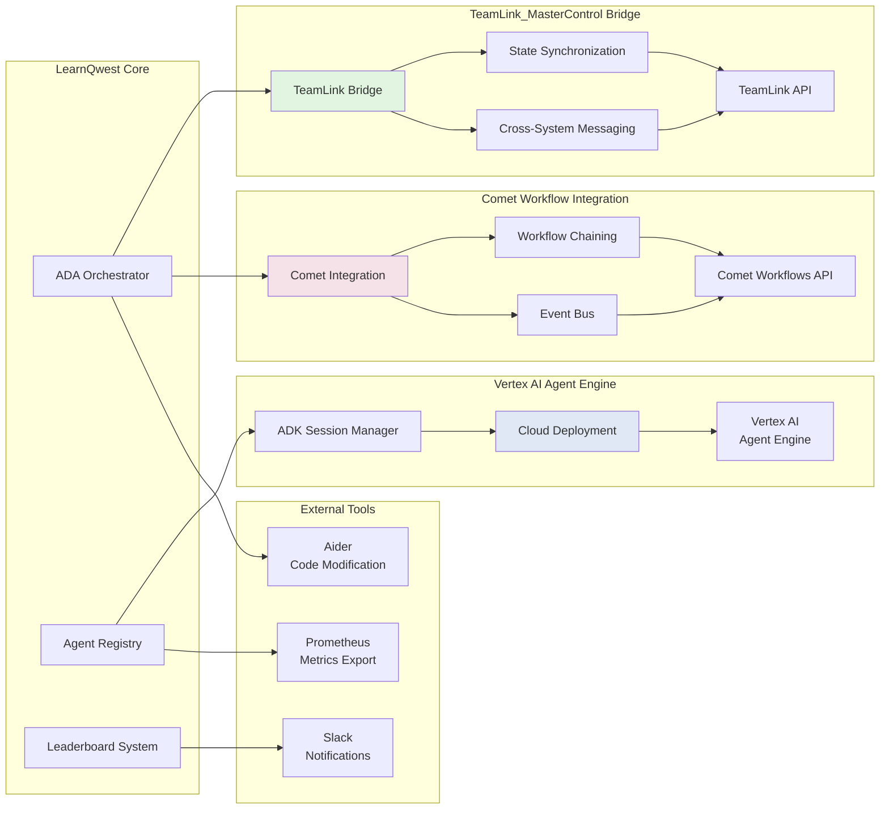
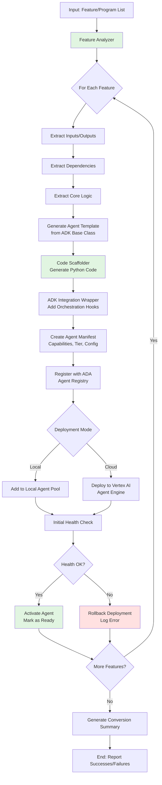
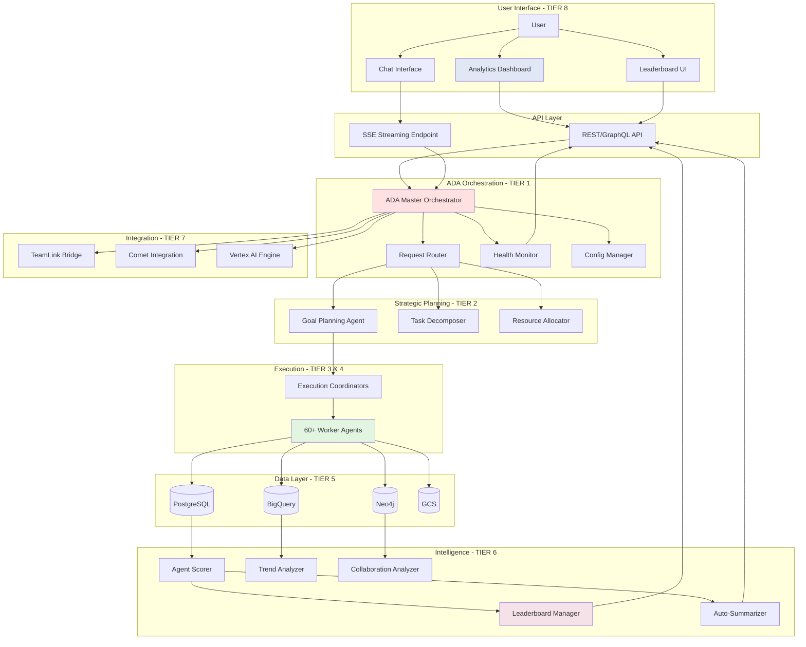

# LearnQwest Workflow Diagrams
## Mermaid Flowcharts for All Agent Workflows

**Generated:** 2025-11-16
**System:** LearnQwest Multi-Agent Orchestration Platform

---

## Table of Contents

1. [Request Flow](#request-flow)
2. [Agent Lifecycle](#agent-lifecycle)
3. [Task Execution Workflow](#task-execution-workflow)
4. [Worklog Processing Pipeline](#worklog-processing-pipeline)
5. [Leaderboard Calculation](#leaderboard-calculation)
6. [Health Monitoring](#health-monitoring)
7. [Data Storage Flow](#data-storage-flow)
8. [Integration Bridges](#integration-bridges)

---

## 1. Request Flow

Complete request routing from user to agent execution:

---

## 2. Agent Lifecycle

Agent registration, health monitoring, and deregistration:

---

## 3. Task Execution Workflow

Detailed task execution through the 8-tier hierarchy:

---

## 4. Worklog Processing Pipeline

Parsing and analytics workflow:

---

## 5. Leaderboard Calculation

Scoring and ranking workflow:

---

## 6. Health Monitoring

Continuous health check and auto-recovery:

---

## 7. Data Storage Flow

Multi-backend data routing:

---

## 8. Integration Bridges

External system integration:

---

## 9. Agent Conversion Pipeline

Batch conversion of features to agents:

---

## 10. End-to-End System Flow

Complete system integration:

---

## Notes

- All workflows support async/parallel execution where possible
- Error handling and retry logic implemented at each tier
- Telemetry and tracing integrated throughout
- Auto-scaling triggered based on load thresholds
- Real-time monitoring via SSE streaming

**END OF WORKFLOW DIAGRAMS**
