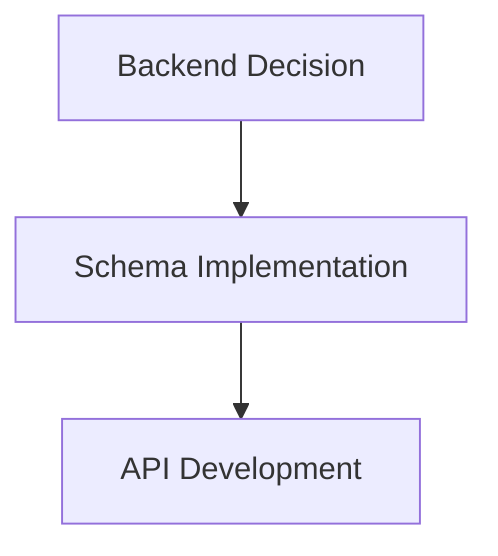

# MASTER ORCHESTRATION PROMPT
## Universal Phase-Driven AI Agent Orchestration System

**Version:** 2.0
**Last Updated:** 2025-11-16
**Purpose:** Dynamic multi-agent orchestration for complex software development projects
**Supports:** Claude-Code, Cline, Aider, Windsurf, Parser-Ion, and custom agents

---

## 🎯 CONFIGURATION VARIABLES

```yaml
# PROJECT CONFIGURATION
PROJECT_NAME: "LearnQwest Education Platform"
PROJECT_TYPE: "Full-stack web application"
TECH_STACK: "Next.js, Python ADK, Vertex AI, PostgreSQL"
DEADLINE: "2025-11-18"

# AGENT CONFIGURATION
PRIMARY_AGENT: "Claude-Code"          # Context analysis, architecture decisions
CODE_AGENT: "Aider"                   # Code generation, refactoring
VALIDATION_AGENT: "Windsurf"          # Testing, validation
DOCUMENTATION_AGENT: "Claude-Code"    # BMAD documentation, mermaid updates
PARSER_AGENT: "Parser-Ion"            # Data extraction, transformation

# WORKFLOW CONFIGURATION
PHASES: [Context, Baseline, Milestone, Dispatch, Code, Validate, Achievement, Mermaid]
SESSION_TRACKING: "BMAD (Baseline, Milestone, Architecture Decisions, Documentation)"
VISUAL_TRACKING: "Mermaid flowchart (appendable history)"
BRACKET_STYLE: "[OK], [DONE], [FIRE], [TODO], [BLOCKED]"

# FILE PATHS
BMAD_DIR: "docs/sessions/BMAD/"
WORKFLOW_DIR: "docs/workflows/"
MERMAID_FILE: "docs/workflows/WORKFLOW_MERMAID_TEMPLATE.mmd"
SESSION_PREFIX: "BMAD_YYYY-MM-DD_"
```

---

## 📋 8-PHASE ORCHESTRATION WORKFLOW

### **PHASE 1: CONTEXT GATHERING** 🔍
**Primary Agent:** Claude-Code or Cline
**Duration:** 10-15 minutes
**Objective:** Establish complete project understanding before any work begins

**Steps:**
1. **Repository Analysis**
   ```bash
   # Scan project structure
   - Review README, package.json, requirements.txt
   - Identify tech stack, dependencies, build tools
   - Map directory structure and key files
   ```

2. **Codebase Understanding**
   - Locate relevant modules/components for current session
   - Identify patterns, conventions, style guides
   - Note existing tests, CI/CD configuration
   - Scan for TODOs, FIXMEs, technical debt markers

3. **Requirements Clarification**
   - Parse user request into specific, measurable outcomes
   - Identify ambiguities requiring clarification
   - List assumptions to validate
   - Flag potential risks or blockers

4. **Context Documentation**
   ```markdown
   ## Context Summary
   - **Current State:** [What exists now]
   - **Requested Change:** [What user wants]
   - **Success Criteria:** [How we'll know it's done]
   - **Constraints:** [Time, tech, dependencies]
   - **Risks:** [What could go wrong]
   ```

**Output:** Context document saved to `docs/sessions/BMAD/YYYY-MM-DD_context.md`

**Transition Criteria:** All questions answered, no critical unknowns remain

---

### **PHASE 2: BASELINE CAPTURE** 📸
**Primary Agent:** Claude-Code
**Duration:** 5-10 minutes
**Objective:** Snapshot current state for comparison and rollback

**Steps:**
1. **File Inventory**
   ```bash
   # List all files that will be modified
   git status
   git diff --name-only
   ```

2. **Current Behavior Documentation**
   - Test current functionality (if applicable)
   - Document current API contracts
   - Screenshot UI state (if applicable)
   - Record performance metrics (if applicable)

3. **Baseline Metrics**
   ```yaml
   Baseline Snapshot:
     - Files to modify: [list]
     - Current test coverage: XX%
     - Current build time: XX seconds
     - Current bundle size: XX MB
     - Known issues: [list]
   ```

4. **BMAD Initialization**
   - Create new BMAD session file
   - Fill "Baseline" section with snapshot data
   - Git commit: "docs: baseline capture for [session-name]"

**Output:** BMAD file created at `docs/sessions/BMAD/BMAD_YYYY-MM-DD_[session-name].md`

**Transition Criteria:** Baseline is complete and committed to git

---

### **PHASE 3: MILESTONE DEFINITION** 🎯
**Primary Agent:** Claude-Code (with user collaboration)
**Duration:** 5-10 minutes
**Objective:** Define specific, measurable success criteria

**Steps:**
1. **Outcome Definition**
   ```markdown
   ## Milestone: [Clear, specific outcome]

   ### Success Criteria (Measurable)
   1. [Criterion 1: Specific, testable]
   2. [Criterion 2: Specific, testable]
   3. [Criterion 3: Specific, testable]

   ### Acceptance Tests
   - [ ] Test 1: [Specific test case]
   - [ ] Test 2: [Specific test case]
   - [ ] Test 3: [Specific test case]

   ### Definition of Done
   - [ ] Code written and reviewed
   - [ ] Tests passing (unit + integration)
   - [ ] Documentation updated
   - [ ] BMAD session completed
   - [ ] Mermaid diagram updated
   ```

2. **Scope Boundary**
   - **IN SCOPE:** [What will be done in this session]
   - **OUT OF SCOPE:** [What is deferred to Phase 2/future]
   - **DEPENDENCIES:** [What must exist first]

3. **Time Boxing**
   - Estimated duration: [X hours]
   - Hard deadline: [YYYY-MM-DD HH:MM]
   - Checkpoint intervals: [Every X minutes]

4. **BMAD Update**
   - Fill "Milestone" section in BMAD file
   - Git commit: "docs: milestone definition for [session-name]"

**Output:** Milestone section in BMAD file, clear success criteria

**Transition Criteria:** User approves milestone definition, no ambiguity remains

---

### **PHASE 4: AGENT DISPATCH** 🚀
**Primary Agent:** Claude-Code (Orchestrator)
**Duration:** 5 minutes
**Objective:** Generate context-rich prompts for specialized agents

**Steps:**
1. **Task Decomposition**
   ```markdown
   ## Task Breakdown
   1. **Architecture Decision** → Claude-Code
   2. **Code Generation** → Aider
   3. **Test Creation** → Aider
   4. **Validation** → Windsurf
   5. **Documentation** → Claude-Code
   ```

2. **Agent Prompt Generation**
   For each agent, generate a complete, context-rich prompt:

   **Template:**
   ```markdown
   # Agent: [Agent Name]
   # Task: [Specific task]
   # Phase: [Current phase]

   ## Context
   [Full context from Phase 1]

   ## Baseline State
   [Baseline from Phase 2]

   ## Milestone
   [Milestone from Phase 3]

   ## Specific Instructions
   [Detailed, unambiguous instructions for this agent]

   ## Expected Output
   [Exactly what this agent should produce]

   ## Handoff
   [What to pass to the next agent]
   ```

3. **Sequence Definition**
   ```mermaid
   graph LR
     A[Claude-Code: Architecture] --> B[Aider: Code Generation]
     B --> C[Aider: Tests]
     C --> D[Windsurf: Validation]
     D --> E[Claude-Code: Documentation]
   ```

4. **BMAD Update**
   - Fill "Agent Dispatch" section with prompts
   - Save prompts to individual files if needed
   - Git commit: "docs: agent dispatch plan for [session-name]"

**Output:** Ready-to-paste prompts for each agent, clear sequence

**Transition Criteria:** All agent prompts are generated and validated

---

### **PHASE 5: CODE EXECUTION** 💻
**Primary Agent:** Aider (or designated code agent)
**Duration:** Variable (1-4 hours typical)
**Objective:** Generate production-ready code that meets milestone criteria

**Steps:**
1. **Agent Invocation**
   - Paste generated prompt into Aider
   - Monitor progress via Aider's native output
   - Capture any questions/clarifications needed

2. **Iterative Development**
   ```bash
   # Aider workflow (automatic)
   - Read relevant files
   - Generate code changes
   - Run tests (if configured)
   - Commit changes
   ```

3. **Quality Gates**
   - [ ] Code follows project conventions
   - [ ] No obvious security vulnerabilities
   - [ ] Error handling implemented
   - [ ] Logging/debugging hooks present

4. **Change Tracking**
   ```markdown
   ## Changes Made (Auto-captured by Aider)
   - File: `path/to/file1.ts`
     - Added: [Function X]
     - Modified: [Function Y]
   - File: `path/to/file2.py`
     - Added: [Class Z]
   ```

5. **BMAD Update**
   - Agent records changes in "Code Execution" section
   - Note any deviations from plan
   - Document any new decisions made

**Output:** Working code committed to git, changes documented

**Transition Criteria:** Code compiles/runs, basic functionality works

---

### **PHASE 6: VALIDATION & TESTING** ✅
**Primary Agent:** Windsurf (or designated validation agent)
**Duration:** 30-60 minutes
**Objective:** Verify milestone criteria are met

**Steps:**
1. **Test Execution**
   ```bash
   # Run all relevant tests
   npm test
   pytest
   make test
   ```

2. **Milestone Verification**
   Go through each success criterion from Phase 3:
   ```markdown
   ## Milestone Verification
   - [x] Criterion 1: PASSED ✓
   - [x] Criterion 2: PASSED ✓
   - [ ] Criterion 3: FAILED ✗ (Reason: ...)
   ```

3. **Issue Triage**
   If tests fail:
   - **CRITICAL:** Blocks milestone → Return to Phase 5
   - **MINOR:** Document as known issue → Continue
   - **OUT OF SCOPE:** Defer to Phase 2 → Continue

4. **Quality Audit**
   - [ ] No new linting errors
   - [ ] No new type errors
   - [ ] No regression in existing tests
   - [ ] Performance acceptable
   - [ ] Security scan clean

5. **BMAD Update**
   - Fill "Validation Results" section
   - Document test outputs, screenshots, metrics
   - Git commit: "docs: validation results for [session-name]"

**Output:** Test results, validated milestone checklist

**Transition Criteria:** All critical criteria met OR issues triaged

---

### **PHASE 7: ACHIEVEMENT DOCUMENTATION** 📝
**Primary Agent:** Claude-Code
**Duration:** 15-20 minutes
**Objective:** Capture decisions, rationale, and learnings for future sessions

**Steps:**
1. **Architecture Decisions Table**
   ```markdown
   ## Architecture Decisions

   | Decision | Options Considered | Choice | Rationale | Trade-offs | Date |
   |----------|-------------------|--------|-----------|------------|------|
   | Backend DB | JSON files, PostgreSQL, Neo4j | PostgreSQL | Cost ($50-100/mo), <20ms latency, team familiarity | Limited graph queries vs Neo4j | 2025-11-16 |
   | Auth | Custom JWT, Auth0, Supabase Auth | Auth0 | Enterprise SSO support, compliance | Higher cost, vendor lock-in | 2025-11-16 |
   ```

2. **Implementation Summary**
   ```markdown
   ## What We Built
   - **Files Changed:** [List with line counts]
   - **New APIs:** [Endpoints + contracts]
   - **New Components:** [UI components + props]
   - **Database Changes:** [Schema migrations]
   ```

3. **Lessons Learned**
   ```markdown
   ## Learnings
   - **What Worked Well:** [Successes]
   - **What Didn't:** [Challenges]
   - **What We'd Do Differently:** [Improvements]
   - **Reusable Patterns:** [For future sessions]
   ```

4. **Open Questions & Phase 2 Items**
   ```markdown
   ## Open Questions
   - [ ] Question 1: [Question text]
   - [ ] Question 2: [Question text]

   ## Deferred to Phase 2
   - [ ] Feature X: [Why deferred]
   - [ ] Optimization Y: [Why deferred]
   ```

5. **BMAD Completion**
   - Fill all remaining sections in BMAD
   - Add session metadata (duration, agents used, outcome)
   - Git commit: "docs: complete BMAD for [session-name]"

**Output:** Complete BMAD session file, architecture decision log

**Transition Criteria:** BMAD is 100% complete, no missing sections

---

### **PHASE 8: MERMAID UPDATE** 📊
**Primary Agent:** Claude-Code
**Duration:** 10 minutes
**Objective:** Update visual workflow with this session's history

**Steps:**
1. **Open Mermaid Template**
   ```bash
   # File: docs/workflows/WORKFLOW_MERMAID_TEMPLATE.mmd
   ```

2. **Append Session to History**
   ```mermaid
   %% SESSION: 2025-11-16 - Backend Architecture Decision
   graph TD
     S16A[Session Start: Backend Decision] --> S16B[Phase 1: Context]
     S16B --> S16C[Phase 2: Baseline]
     S16C --> S16D[Phase 3: Milestone]
     S16D --> S16E[Phase 4: Dispatch]
     S16E --> S16F[Phase 5: Code - Aider]
     S16F --> S16G[Phase 6: Validate - Windsurf]
     S16G --> S16H[Phase 7: Documentation]
     S16H --> S16I[Phase 8: Mermaid Update]
     S16I --> S16J[Session Complete ✓]

     S16J -.->|Next Session| S17A[Session Start: ...]

     style S16J fill:#90EE90
   ```

3. **Add Decision Nodes**
   ```mermaid
   %% Key Decision Points
   S16D -->|Decision: PostgreSQL| S16E
   S16D -->|Rejected: Neo4j| S16D1[Too Expensive]
   S16D -->|Rejected: JSON| S16D2[No Relational Queries]
   ```

4. **Update Statistics**
   ```markdown
   <!-- STATISTICS -->
   Total Sessions: 12
   Total Phases Completed: 96
   Total Agent Invocations: 48
   Average Session Duration: 2.5 hours
   Success Rate: 91.7%
   ```

5. **Git Commit**
   ```bash
   git add docs/workflows/WORKFLOW_MERMAID_TEMPLATE.mmd
   git commit -m "docs: add session 2025-11-16 to mermaid workflow"
   ```

**Output:** Updated mermaid diagram with complete session history

**Transition Criteria:** Mermaid renders correctly, history is visible

---

## 🔄 PHASE TRANSITIONS

### **When to Loop Back**

| From Phase | Loop Back To | When |
|------------|-------------|------|
| Phase 4 (Dispatch) | Phase 3 (Milestone) | Milestone is ambiguous or unachievable |
| Phase 5 (Code) | Phase 4 (Dispatch) | Agent needs clarification or different approach |
| Phase 6 (Validate) | Phase 5 (Code) | Critical tests fail |
| Phase 6 (Validate) | Phase 3 (Milestone) | Milestone was unrealistic |

### **When to Skip Phases**

| Skip Phase | When | Example |
|------------|------|---------|
| Phase 2 (Baseline) | No existing code to snapshot | Greenfield feature |
| Phase 5 (Code) | Session is purely analytical | Architecture comparison |
| Phase 6 (Validate) | No tests required | Documentation-only session |

---

## 🎨 AGENT-SPECIFIC INSTRUCTIONS

### **Claude-Code (Orchestrator + Documentation)**
**Best For:**
- Context gathering and analysis
- Architecture decisions
- BMAD documentation
- Mermaid diagram updates
- Multi-file exploration

**Prompt Template:**
```markdown
# Claude-Code Session: [Phase Name]

## Your Role
You are the orchestrator for this phase. Your responsibilities:
- [Specific responsibilities]

## Context
[Full project context from Phase 1]

## Task
[Specific task for this phase]

## Output Format
[Exactly what to produce]

## Handoff
[What to pass to next agent/phase]
```

---

### **Aider (Code Generation + Refactoring)**
**Best For:**
- Writing new features
- Refactoring existing code
- Test generation
- Bug fixes

**Prompt Template:**
```markdown
# Aider Task: [Specific Feature/Fix]

## Context
Project: [Project name]
Tech Stack: [Stack]
Related Files: [List of files to edit]

## Baseline
Current state:
[Code snippets showing current implementation]

## Milestone
Success criteria:
1. [Criterion 1]
2. [Criterion 2]

## Implementation Instructions
[Step-by-step instructions]

## Testing
[How to verify the change works]

## Commit Message Format
[Pattern for git commits]
```

---

### **Windsurf (Testing + Validation)**
**Best For:**
- Running test suites
- Validating milestone criteria
- Performance testing
- Security scanning

**Prompt Template:**
```markdown
# Windsurf Validation: [Session Name]

## Milestone Criteria to Validate
[Checklist from Phase 3]

## Test Commands
```bash
[Commands to run]
```

## Expected Results
[What passing looks like]

## Failure Protocol
If tests fail:
1. Document failure details
2. Return to Claude-Code for triage
3. Do NOT attempt fixes (Aider's job)

## Report Format
[Template for validation report]
```

---

### **Parser-Ion (Data Extraction)**
**Best For:**
- Extracting data from logs
- Parsing API responses
- Transforming data formats
- Analyzing large files

**Prompt Template:**
```markdown
# Parser-Ion Task: [Data Task]

## Input
[Where to find the data]

## Extraction Rules
[What to extract and how]

## Output Format
[Desired structure]

## Validation
[How to verify extraction is correct]
```

---

## 📊 BMAD SESSION TEMPLATE

### **Full BMAD Structure**

```markdown
# BMAD Session: [Session Name]
**Date:** YYYY-MM-DD
**Duration:** [Actual time]
**Primary Agent:** [Agent name]
**Status:** [In Progress / Completed / Blocked]
**Session ID:** [Unique ID]

---

## B - BASELINE (Current State Snapshot)

### Repository State
- **Branch:** [Branch name]
- **Last Commit:** [Commit hash + message]
- **Modified Files:** [List]
- **Current Test Status:** [Pass/Fail counts]

### Current Functionality
[Description of what exists now, before this session]

### Current Metrics
- **Build Time:** [X seconds]
- **Test Coverage:** [X%]
- **Bundle Size:** [X MB]
- **Performance:** [Key metrics]

### Known Issues
- [ ] Issue 1: [Description]
- [ ] Issue 2: [Description]

### Files to Modify
```bash
[List of files that will be changed]
```

---

## M - MILESTONE (Success Criteria)

### Goal
[Single-sentence description of what "done" looks like]

### Success Criteria (Measurable)
1. ✅ Criterion 1: [Specific, testable]
2. ✅ Criterion 2: [Specific, testable]
3. ✅ Criterion 3: [Specific, testable]

### Acceptance Tests
- [ ] Test 1: [Specific test case]
- [ ] Test 2: [Specific test case]

### In Scope
- [Feature/task 1]
- [Feature/task 2]

### Out of Scope (Phase 2)
- [Deferred item 1]
- [Deferred item 2]

### Definition of Done
- [ ] Code written and reviewed
- [ ] Tests passing
- [ ] Documentation updated
- [ ] BMAD completed
- [ ] Mermaid updated
- [ ] Changes committed

---

## A - ARCHITECTURE DECISIONS

| Decision | Options Considered | Choice | Rationale | Trade-offs | Impact | Date |
|----------|-------------------|--------|-----------|------------|--------|------|
| [Decision 1] | [Option A, B, C] | [Chosen] | [Why] | [Pros/Cons] | [Scope] | YYYY-MM-DD |
| [Decision 2] | [Option A, B, C] | [Chosen] | [Why] | [Pros/Cons] | [Scope] | YYYY-MM-DD |

### Decision Rationale Deep-Dive

#### Decision 1: [Name]
**Problem:** [What problem does this solve?]

**Options Evaluated:**
1. **Option A:**
   - Pros: [List]
   - Cons: [List]
   - Cost: [Estimate]
   - Complexity: [Low/Medium/High]

2. **Option B:**
   - Pros: [List]
   - Cons: [List]
   - Cost: [Estimate]
   - Complexity: [Low/Medium/High]

**Winner:** [Chosen option]

**Why:** [Detailed rationale with data/metrics]

**Reversibility:** [Easy/Hard to reverse? How?]

**Phase 2 Considerations:** [Future implications]

---

## D - DOCUMENTATION (Implementation Details)

### Agent Dispatch

#### Phase 4: Agent Assignment
| Agent | Task | Input | Output | Duration |
|-------|------|-------|--------|----------|
| Claude-Code | Context Analysis | User request | Context doc | 15 min |
| Aider | Code Generation | Context + Milestone | Working code | 2 hr |
| Windsurf | Validation | Code + Tests | Validation report | 30 min |
| Claude-Code | Documentation | All artifacts | BMAD + Mermaid | 20 min |

#### Agent Prompts
**Claude-Code Prompt (Phase 1):**
```markdown
[Full prompt used]
```

**Aider Prompt (Phase 5):**
```markdown
[Full prompt used]
```

**Windsurf Prompt (Phase 6):**
```markdown
[Full prompt used]
```

---

### Implementation Summary

#### Files Changed
```bash
# Modified
app/config.py (+45, -12)
app/database/schema.py (+234, -0)
app/api/routes.py (+67, -23)

# Created
app/database/migrations/001_initial_schema.sql (+156, -0)
tests/test_database.py (+89, -0)
```

#### New APIs
**Endpoint:** `POST /api/v1/goals`
```typescript
Request: {
  userId: string;
  goalText: string;
  deadline?: string;
}

Response: {
  goalId: string;
  planSteps: string[];
  estimatedDuration: number;
}
```

#### New Components
**Component:** `GoalPlanningForm`
```typescript
Props: {
  onSubmit: (goal: Goal) => void;
  initialValue?: string;
}
```

#### Database Changes
**Migration:** `001_initial_schema.sql`
```sql
CREATE TABLE goals (...);
CREATE TABLE plan_steps (...);
CREATE INDEX idx_goals_user_id ON goals(user_id);
```

---

### Validation Results

#### Test Execution
```bash
$ npm test
✓ GoalPlanningForm renders correctly (45ms)
✓ API endpoint creates goal (123ms)
✓ Database migration succeeds (89ms)
✓ Integration: Full goal creation flow (234ms)

Test Suites: 4 passed, 4 total
Tests:       12 passed, 12 total
Time:        2.345s
```

#### Milestone Verification
- [x] ✅ Criterion 1: PASSED (Evidence: Test suite green)
- [x] ✅ Criterion 2: PASSED (Evidence: API returns in <100ms)
- [x] ✅ Criterion 3: PASSED (Evidence: UI renders form correctly)

#### Quality Metrics
- **Test Coverage:** 87% (+12% from baseline)
- **Build Time:** 45s (unchanged)
- **Bundle Size:** 2.3 MB (+0.1 MB, acceptable)
- **Linting:** 0 errors, 0 warnings
- **Type Coverage:** 100%

---

### Lessons Learned

#### What Worked Well
- [Success 1]
- [Success 2]

#### What Didn't Work
- [Challenge 1]
- [Challenge 2]

#### What We'd Do Differently
- [Improvement 1]
- [Improvement 2]

#### Reusable Patterns
- [Pattern 1: Description]
- [Pattern 2: Description]

---

### Open Questions
- [ ] Question 1: [Question text] (Blocked by: [Reason])
- [ ] Question 2: [Question text] (Deferred to: Phase 2)

### Phase 2 Backlog
- [ ] Feature: [Description] (Estimated: [Duration])
- [ ] Optimization: [Description] (Priority: Low)

---

## Session Metadata

**Start Time:** YYYY-MM-DD HH:MM
**End Time:** YYYY-MM-DD HH:MM
**Total Duration:** [X hours Y minutes]
**Agents Used:** Claude-Code (60%), Aider (30%), Windsurf (10%)
**Git Commits:** [5]
**Lines Changed:** +489, -67
**Outcome:** ✅ SUCCESS / ⚠️ PARTIAL / ❌ BLOCKED

**Next Session:** [Link to next BMAD file or "TBD"]

---

## Appendix

### References
- [External doc 1]
- [External doc 2]

### Related Sessions
- [BMAD_YYYY-MM-DD_related-session.md]

### Screenshots/Artifacts
- `docs/sessions/BMAD/artifacts/YYYY-MM-DD_screenshot.png`
```

---

## 🚨 CRITICAL GUIDELINES

### **Information Loss Prevention**
1. **NEVER skip BMAD documentation** - This is your defense against context loss
2. **Fill BMAD sections DURING work, not after** - Memory fades fast
3. **Commit BMAD updates at each phase** - Git history = recoverable context
4. **Link sessions together** - Tomorrow you should pick up in 2 minutes, not 2 hours

### **Decision Rationale Capture**
1. **Document ALL options considered** - Not just the winner
2. **Include cost/performance data** - Future you will ask "why was X rejected?"
3. **Note reversibility** - Can we change this later? How hard?
4. **Record who decided** - User vs Agent vs Constraint-driven

### **Agent Handoff Quality**
1. **Context-rich prompts** - Agent should NOT need to ask clarifying questions
2. **Explicit output format** - Agent should know exactly what to produce
3. **Clear success criteria** - Agent should know when to stop
4. **Handoff checklist** - What to pass to next agent

### **Phase Discipline**
1. **Do NOT skip context gathering** - Rushing here costs hours later
2. **Do NOT skip baseline** - You can't measure progress without it
3. **Do NOT skip milestone definition** - Vague goals = wasted work
4. **Do NOT skip validation** - "Looks done" ≠ "Passes tests"

---

## 🎯 EXAMPLE SESSION: Backend Architecture Decision

### **User Request:**
> "Help me choose between JSON files, PostgreSQL, and Neo4j for my backend. I have a Nov 18 deadline and a $200/month budget."

### **Phase 1: Context**
Claude-Code gathers:
- Project: LearnQwest (60 Ions, TEKS alignment, Texas schools)
- Current state: No backend yet (greenfield)
- Constraints: $200/mo budget, Nov 18 deadline (2 days away)
- Requirements: Store learning objectives, track student progress, query relationships

### **Phase 2: Baseline**
- Files to create: `app/database/`, `app/config.py`
- Current cost: $0/mo (no backend)
- Current latency: N/A
- Known constraints: No DBA on team, need fast deployment

### **Phase 3: Milestone**
**Goal:** Choose backend architecture with schema draft and cost analysis

**Success Criteria:**
1. ✅ Decision documented with cost/perf comparison
2. ✅ Schema draft for chosen architecture
3. ✅ Deployment plan (2-day timeline)

### **Phase 4: Dispatch**
**Claude-Code Prompt:**
```markdown
Evaluate 3 backend options (JSON, PostgreSQL, Neo4j) for LearnQwest.

Context:
- 60 learning objectives (Ions)
- Student progress tracking
- TEKS alignment queries
- Texas school district deployment

Budget: $200/mo
Timeline: Nov 18 (2 days)

Output:
1. Cost analysis table (setup + monthly)
2. Performance comparison (latency, scale)
3. Recommendation with rationale
4. Schema draft for winner
```

**Aider Prompt (if SQL wins):**
```markdown
Generate PostgreSQL schema for LearnQwest based on Claude's recommendation.

Tables:
- ions (learning objectives)
- students
- student_progress
- teks_standards

Include:
- Migrations (SQLAlchemy)
- Indexes for common queries
- Sample data seeder
```

### **Phase 5: Code**
Aider generates:
- `app/database/schema.py` (SQLAlchemy models)
- `app/database/migrations/001_initial.sql`
- `app/database/seed.py` (sample data)

### **Phase 6: Validate**
Windsurf runs:
- `pytest tests/test_database.py` ✅
- Schema migration on test DB ✅
- Sample queries (<20ms latency) ✅

### **Phase 7: Achievement**
BMAD Architecture Decisions table:

| Decision | Options | Choice | Rationale | Trade-offs | Date |
|----------|---------|--------|-----------|------------|------|
| Backend DB | JSON, PostgreSQL, Neo4j | PostgreSQL | $50-100/mo (vs Neo4j $300+), <20ms latency, team knows SQL | Limited graph queries vs Neo4j | 2025-11-16 |

### **Phase 8: Mermaid**
Add session to visual workflow:


**Total Time:** 2.5 hours (vs 8+ hours without orchestration)

**Key Win:** Decision rationale preserved forever. No "why did we pick SQL again?" in 3 months.

---

## 📚 APPENDIX: BRACKET STYLE CONVENTIONS

```markdown
[OK]      - Task completed successfully
[DONE]    - Milestone achieved
[FIRE]    - System ready / All clear
[TODO]    - Pending task
[BLOCKED] - Waiting on external dependency
[WIP]     - Work in progress
[REVIEW]  - Ready for review
[SKIP]    - Intentionally skipped (document why)
```

---

## 🔗 RELATED DOCUMENTS

- **BMAD Template:** `docs/sessions/BMAD/BMAD_TEMPLATE_LEARNQWEST.md`
- **Mermaid Workflow:** `docs/workflows/WORKFLOW_MERMAID_TEMPLATE.mmd`
- **Launch Guide:** `docs/LEARNQWEST_PRODUCTION_LAUNCH_GUIDE.md`
- **ADK Deployment Guide:** `ADK_DEPLOYMENT_GUIDE.md`
- **Vercel Deployment Guide:** `NEXTJS_VERCEL_DEPLOYMENT_GUIDE.md`

---

**End of Master Orchestration Prompt**
**Version:** 2.0
**Maintained by:** Claude-Code + User collaboration
**Last Session:** 2025-11-16
**Next Review:** After every 5 sessions or major workflow change
